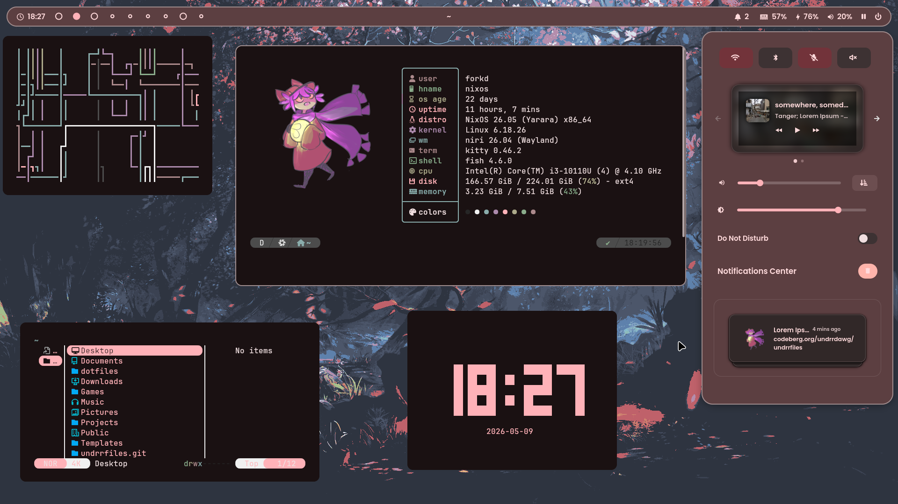
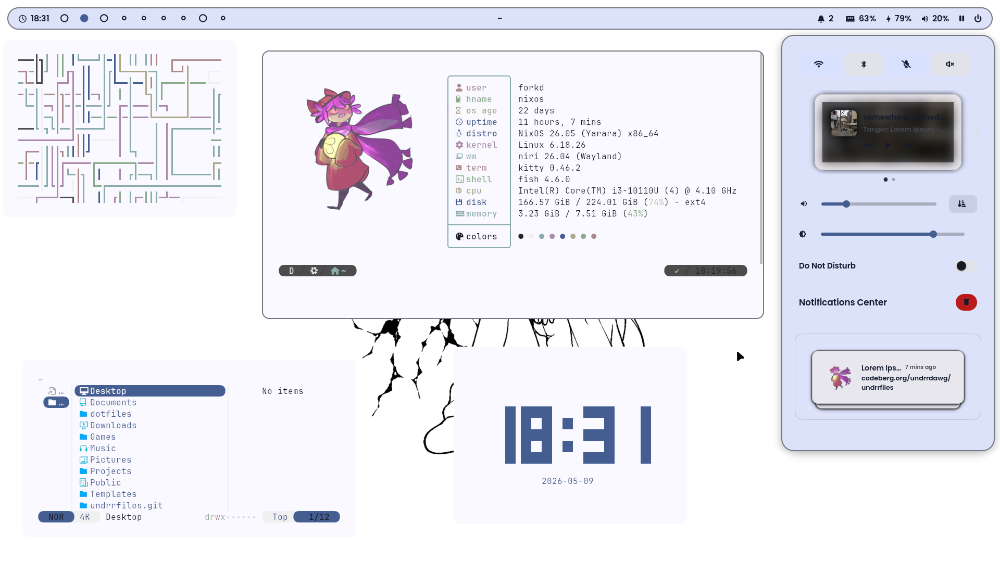
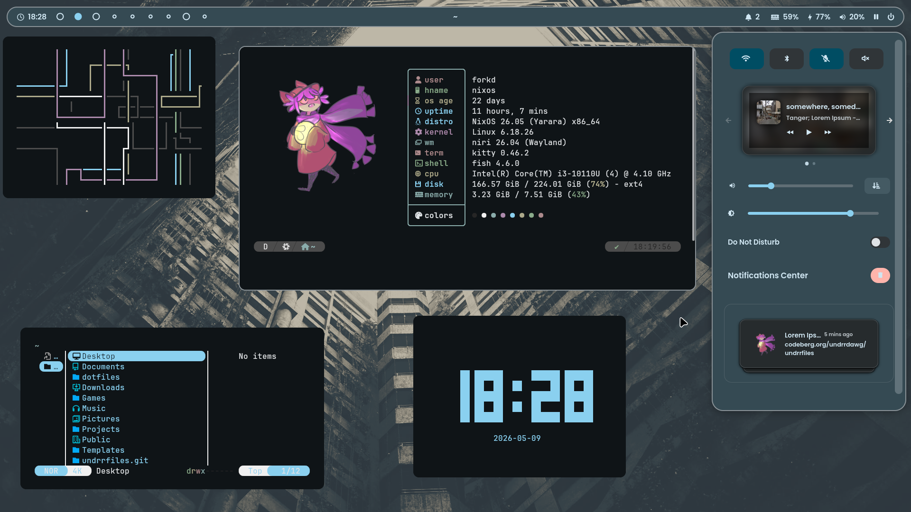
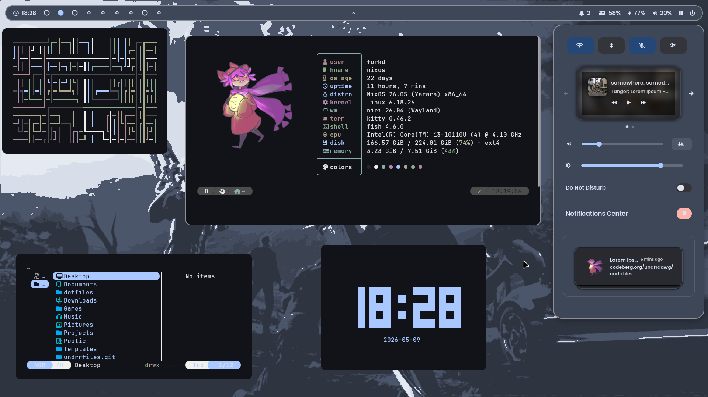
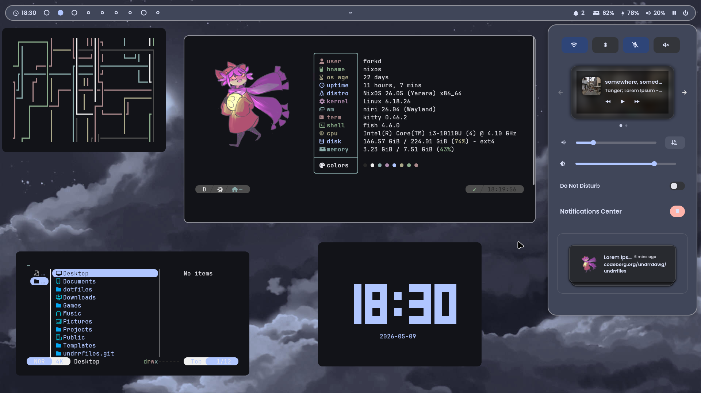

<div align="center">

# undrrdawg's shitty dotfiles
<details>
  <summary>screenshots</summary>
  <br>
  
  
  
  
  
</details>

be aware that this rice is a bit incomplete so you might encounter some styling bugs, i have no idea how to fix some of them
</div>

## details
### desktop
- os: [nixos](https://nixos.org/)
- wm: [niri](https://github.com/niri-wm/niri)
- bar: [waybar](https://github.com/alexays/waybar)
- app launcher: [fsel](https://github.com/mjoyufull/fsel) paired with [otter-launcher](https://github.com/kuokuo123/otter-launcher)

### terminal
- terminal: [kitty](https://github.com/kovidgoyal/kitty)
- fetch: [fastfetch](https://github.com/fastfetch-cli/fastfetch)
- shell: [fish](https://github.com/fish-shell/fish-shell)
- prompt: [tide](https://github.com/ilancosman/tide)
- notifications: [swaync](https://github.com/erikreider/swaynotificationcenter)

### themes / fonts
- color scheme: generated with [matugen](https://github.com/InioX/matugen)
- font: jetbrainsmono nerd font for terminal/mono, poppins semibold for ui

## installation 
### nixos:
> [!warning]  
> this will overwrite your existing configuration.nix file. though, the script backs up /etc/nixos and we're talking about nixos so you can just roll back at any time.

```shell
sudo nixos-generate-config --show-hardware-config > /tmp/hardware-configuration.nix
nix-shell -p git --run "git clone https://codeberg.org/forkd/dotfiles ~/dotfiles"
cp /tmp/hardware-configuration.nix ~/dotfiles/nixos/hardware-configuration.nix
sudo mv /etc/nixos /etc/nixos.bak
sudo ln -sf /home/$user/dotfiles /etc/nixos
sudo nixos-rebuild switch
```

### other distros:
- .config is extremely outdated because i just use HM, sorry! you can install home manager on your preferred distro and use my configs if you want
